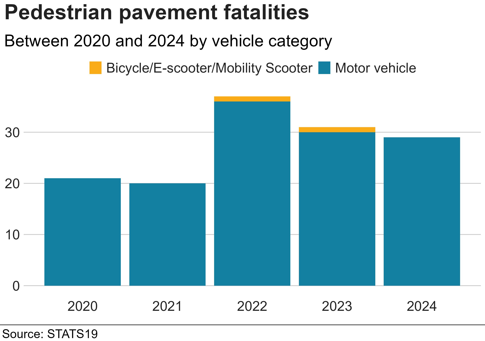
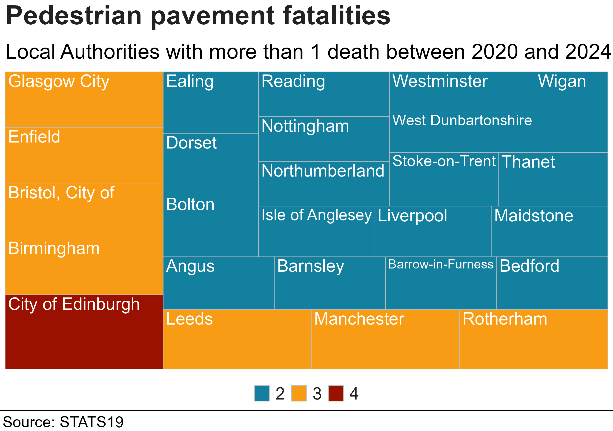
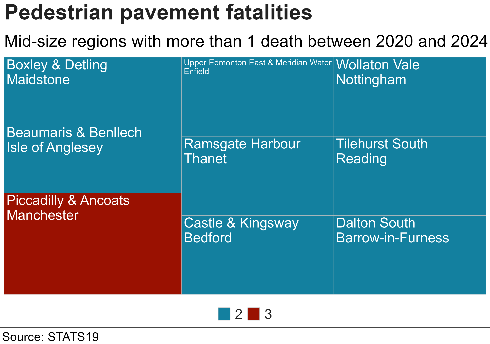
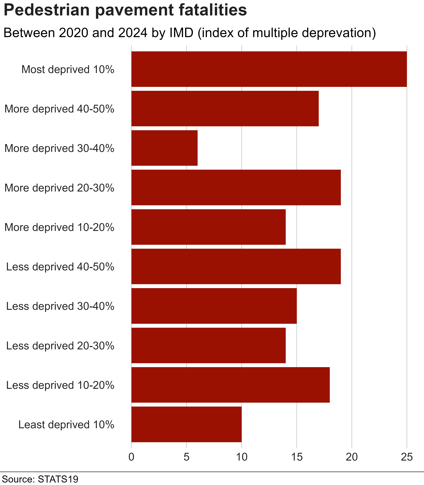
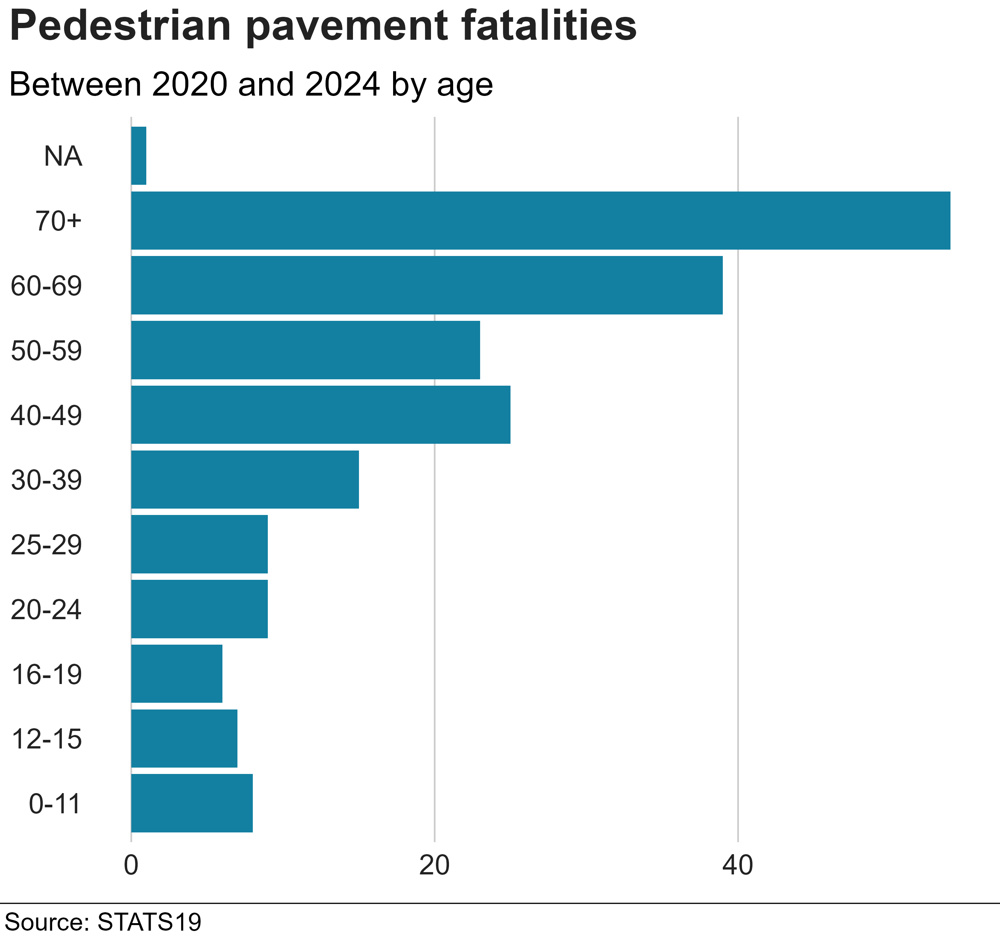

# STATS19 Pedestrian Pavement analysis

Reproducible analysis and plots of pavement pedestrian fatalities from
STATS19 data.

To generate the plots below, clone repository and run “analysis.R”.

Plots were suggested to the BBC and formatted using the BBC style
package [bbplot](https://github.com/bbc/bbplot).

The plot below shows fatalities by year and summary vehicle category.
Motor vehicle category is to summarise large, fast vehicles, shown in table below.

| vehicle_type | short_name | vehicle_cat |
|:---|:---|:---|
| Motorcycle 125cc and under | Motorcycle | Motor vehicle |
| Car | Car | Motor vehicle |
| Goods 7.5 tonnes mgw and over | Goods vehicle | Motor vehicle |
| Motorcycle 50cc and under | Motorcycle | Motor vehicle |
| Bus or coach (17 or more pass seats) | Bus | Motor vehicle |
| Van / Goods 3.5 tonnes mgw or under | Goods vehicle | Motor vehicle |
| Taxi/Private hire car | Taxi | Motor vehicle |
| Agricultural vehicle | Agricultural vehicle | Motor vehicle |
| Goods over 3.5t. and under 7.5t | Goods vehicle | Motor vehicle |
| Motorcycle over 500cc | Motorcycle | Motor vehicle |
| Minibus (8 - 16 passenger seats) | Bus | Motor vehicle |
| Other vehicle | Other vehicle | Unknown |
| Motorcycle over 125cc and up to 500cc | Motorcycle | Motor vehicle |
| Goods vehicle - unknown weight | Goods vehicle | Motor vehicle |
| Mobility scooter | Mobility scooter | Bicycle/E-scooter/Mobility Scooter |
| Pedal cycle | Pedal cycle | Bicycle/E-scooter/Mobility Scooter |
| e-scooter | e-scooter | Bicycle/E-scooter/Mobility Scooter |
| Motorcycle - unknown cc | Motorcycle | Motor vehicle |
| Electric motorcycle | Motorcycle | Motor vehicle |
| NA | NA | Unknown |
| Unknown vehicle type (self rep only) | Other vehicle | Unknown |
| Tram | Tram | Tram |

Where did they happen, grouped by Local Authority region (LA) for Great Britain 

Grouped by Medium Super Output Area (MSOA) for England and Wales and
“Multi Member Ward” for Scotland
https://hub.arcgis.com/datasets/stirling-council::open-data-scottish-local-authority-multi-member-ward-boundaries/about
which is used in the Scottish casualty data as a smaller region than
Council
https://www.scotland.police.uk/about-us/how-we-do-it/road-traffic-collision-data/

 What was the IMD of casualties
involved? Data with no IMD (approx 25%) was removed.

 What was the age groups of
casualties involved? One fatality was removed with not age record.

