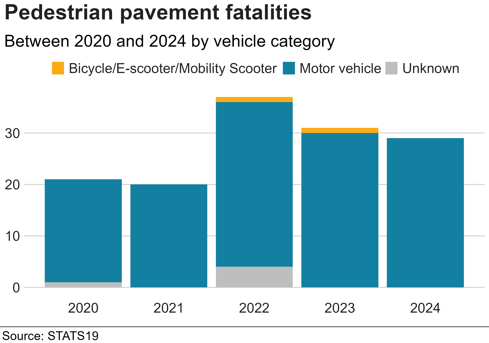
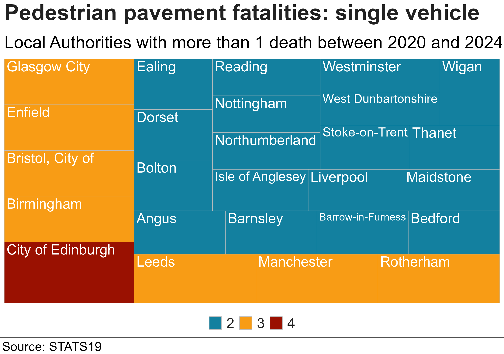
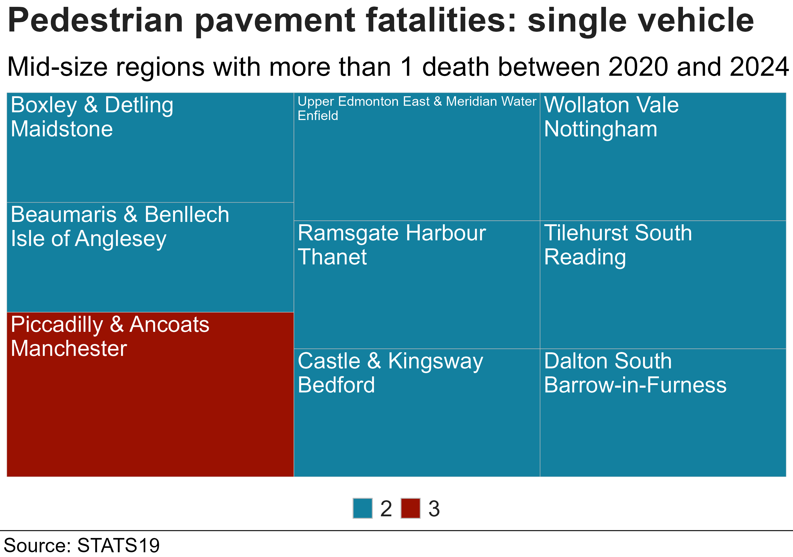
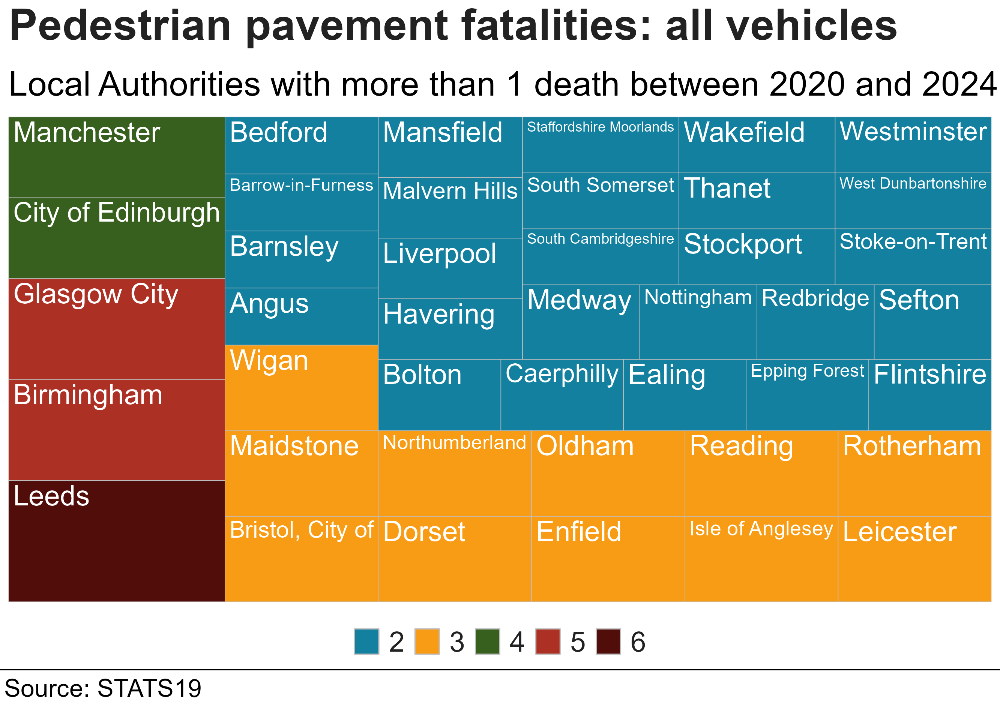
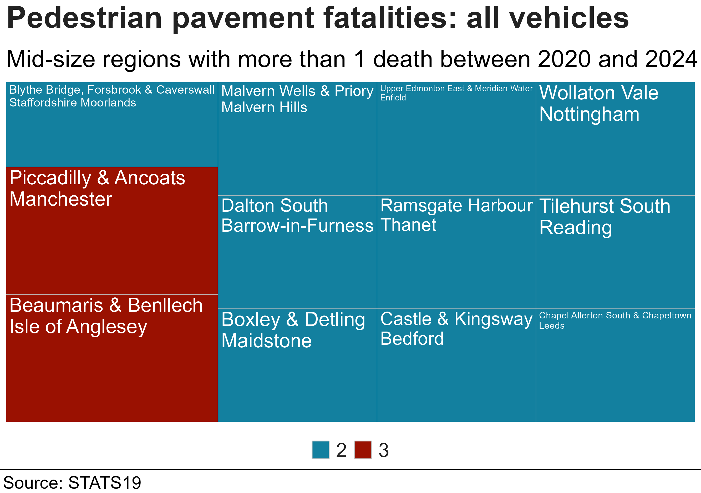
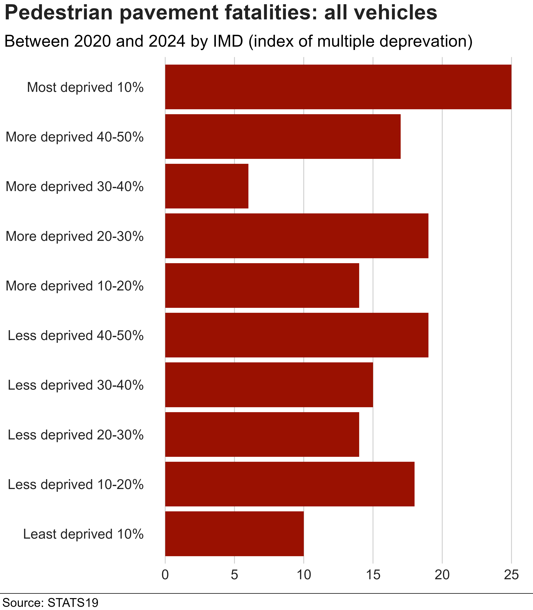
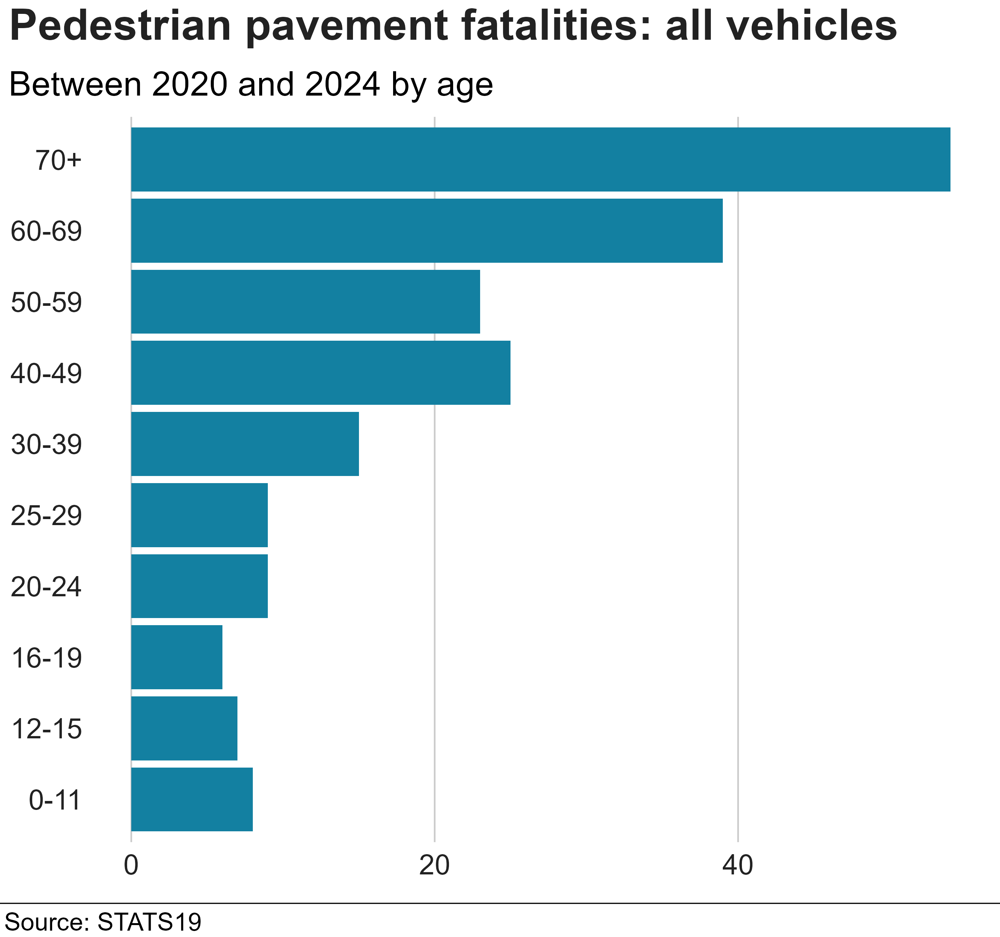

Reproducible analysis and plots of pavement pedestrian fatalities from STATS19 data covering Great Britain.

To generate the plots below, clone repository and run "analysis.R".

Plots were suggested to the BBC and formatted using the BBC style package [bbplot](https://github.com/bbc/bbplot).

The plot below shows fatalities by year and summary vehicle category. Motor vehicle category is to summarise large, fast vehicles. Breakdown shown in table below.

```{r,echo=FALSE}

cat_table = readRDS("vehicle_categories.RDS")
knitr::kable(cat_table)

```



Where did they happen, single vehicle pavement collisions grouped by Local Authority region (LA) for Great Britain.



Single vehicle collisions grouped by Medium Super Output Area (MSOA) for England and Wales and "Multi Member Ward" for Scotland https://hub.arcgis.com/datasets/stirling-council::open-data-scottish-local-authority-multi-member-ward-boundaries/about which is used in the Scottish casualty data as a smaller region than Council https://www.scotland.police.uk/about-us/how-we-do-it/road-traffic-collision-data/.



Single vehicle collisions are used as it is clear the vehicle respnsible, however there are more collisions where more vehicles were involved. The plots below are for all vehicles.

All vehicle pavement collisions grouped by Local Authority region (LA) for Great Britain.



All vehicle collisions grouped by Medium Super Output Area (MSOA) for England and Wales and "Multi Member Ward" for Scotland https://hub.arcgis.com/datasets/stirling-council::open-data-scottish-local-authority-multi-member-ward-boundaries/about which is used in the Scottish casualty data as a smaller region than Council https://www.scotland.police.uk/about-us/how-we-do-it/road-traffic-collision-data/.


What was the IMD of casualties involved? Data with no IMD (approx 25%) was removed.


What was the age groups of casualties involved? One fatality was removed with not age record.


